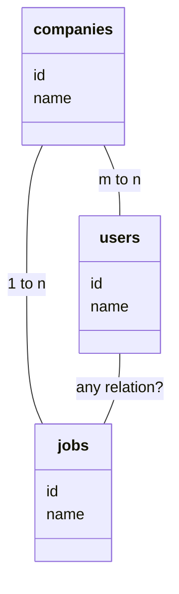
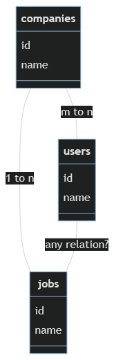

# 1 creating model classes and dependent policies

```make:model``` Create a new Eloquent model class

```make:policy``` Create a new policy class

```-mcr```

- ```--migration``` Create a new migration file for the model
- ```--controller``` Create a new controller for the model
- ```--resource``` Indicates if the generated controller should be a resource controller

## 1.1 Job and JobPolicies

### 1.1.1 create model class "Job"

> php artisan make:model Job -mcr

    Model created successfully.
    Created Migration: 2022_01_25_143055_create_jobs_table
    Controller created successfully.

### 1.1.2 create policy class "JobPolicy" for model class "Job"

> php artisan make:policy JobPolicy -model:Job

doesn't work

    Too many arguments to "make:policy" command, expected arguments "name".

#### 1.1.2.1 use instead

> php artisan make:policy JobPolicy -m=Job

does the job

    Policy created successfully.

## 1.2 Company and CompanyPolicy

### 1.2.1 create model class "Company"

> php artisan make:model Company -mcr

    Model created successfully.
    Created Migration: 2022_01_26_091248_create_companies_table
    Controller created successfully.

### 1.2.2 create policy class "CompanyPolicy" for model class "Company"

> php artisan make:policy CompanyPolicy -m=Company

    Policy created successfully.

# 2 database and structure

## 2.1 relationships between tables

> Each job belongs to a company
>
> Each company has many jobs

companies:jobs is 1:n


> Each Company has many users
>
> Each user has many companies

companies:users is m:n

mermaid diagram:




